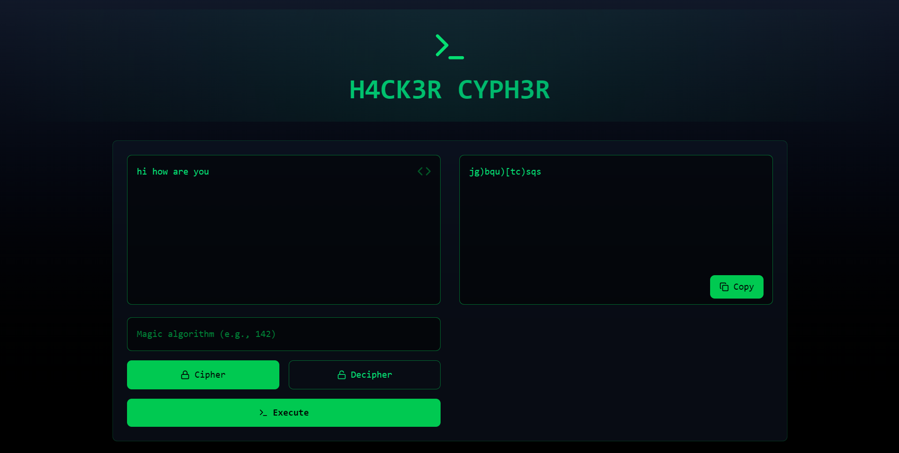

# H4CK3R CYPH3R

**H4CK3R CYPH3R** is a powerful text encryption and decryption tool that simulates a hacker's terminal interface. It allows users to encrypt and decrypt text based on a magic algorithm with real-time animations, a hacker-themed cursor, and a matrix-style loading screen. 

## Features

- **Encryption & Decryption**: Encrypt and decrypt text based on the custom magic algorithm.
- **Matrix-Inspired Loading**: A hacker-themed loading screen with real-time character effects.
- **Custom Cursor**: Unique hacker-themed cursor that adds to the immersive experience.
- **Clipboard Copy**: Copy the encrypted/decrypted result to the clipboard.
- **Responsive Design**: Optimized for both desktop and mobile devices.

## Screenshot

